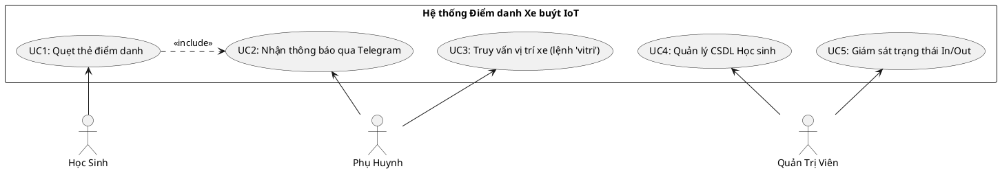
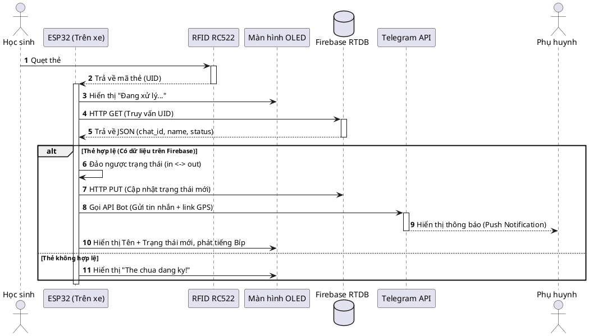
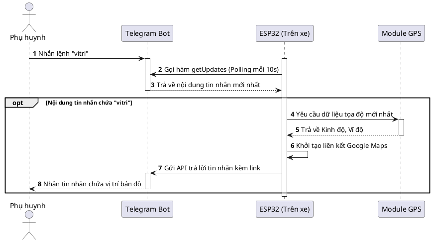
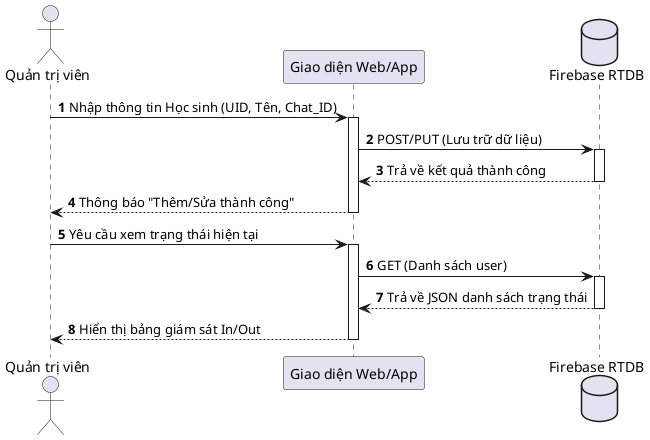
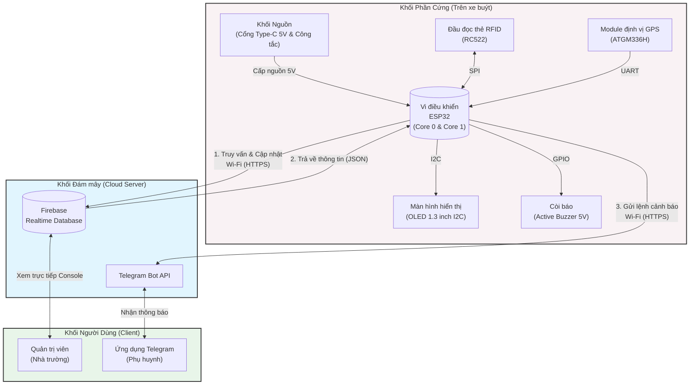

# Tổng hợp Code Vẽ Biểu Đồ (PlantUML & Mermaid)

File này chứa các đoạn mã nguồn để vẽ biểu đồ cho đồ án. 
- Code **PlantUML** (`plantuml`): copy và dán vào [PlantText](https://www.planttext.com/) hoặc [PlantUML Web](https://plantuml.com/plantuml).
- Code **Mermaid** (`mermaid`): copy và dán vào [Mermaid Live Editor](https://mermaid.live/).

---

## 1. Biểu đồ Use Case (Ca sử dụng) - PlantUML

*Ghi chú: PlantUML hỗ trợ vẽ biểu đồ Use Case trực quan và chuẩn mực hơn Mermaid.*



---

## 2. Biểu đồ Sequence (Tuần tự) - PlantUML

### 2.1 Sequence Diagram: Quẹt thẻ và nhận thông báo (UC1 & UC2)

Mô tả quá trình từ lúc học sinh quẹt thẻ trên xe buýt cho đến khi phụ huynh nhận được thông báo qua Telegram.



### 2.2 Sequence Diagram: Truy vấn vị trí xe buýt (UC3)

Mô tả quá trình phụ huynh chủ động nhắn tin cho Bot để hỏi vị trí.



### 2.3 Sequence Diagram: Quản lý thông tin học sinh (UC4, UC5)



---

## 3. Các Sơ đồ Tổng quan - Mermaid

### 3.1 Sơ đồ Khối Kiến Trúc Hệ Thống (System Architecture Diagram)

Sơ đồ này biểu diễn các khối phần cứng kết nối với ESP32 và tương tác với hệ thống Cloud/App.



### 3.2 Sơ đồ Luồng Thuật Toán ESP32 (Flowchart)

Lưu đồ thuật toán chạy song song (Multi-tasking) trên 2 nhân của ESP32.

```mermaid
flowchart TD
    Start([Bắt đầu khởi động ESP32]) --> Setup[1. Thiết lập: Wi-Fi, OLED, I2C, SPI, UART]
    Setup --> Split{Phân chia Luồng\n(Dual Core)}

    %% Core 0 - Xử lý GPS
    Split --> |Core 0| TaskGPS[Task: gpsTask]
    TaskGPS --> ReadGPS[Liên tục đọc dữ liệu tọa độ từ GPS ATGM336H]
    ReadGPS --> ParseGPS[Giải mã NMEA bằng TinyGPS++]
    ParseGPS --> DelayGPS[Delay 10ms]
    DelayGPS --> ReadGPS

    %% Core 1 - Xử lý Chính
    Split --> |Core 1| LoopMain[Vòng lặp chính: loop]
    LoopMain --> CheckWifi{2. Kiểm tra kết nối Wi-Fi}
    CheckWifi -- Mất kết nối --> Reconnect[Thử kết nối lại Wi-Fi]
    Reconnect --> CheckWifi
    
    CheckWifi -- Đã kết nối --> CheckCard{3. Quét thẻ RFID RC522?}
    CheckCard -- Có --> GetUID[Chuyển đổi sang chuỗi UID HEX]
    GetUID --> FirebaseGet[4. Gửi HTTP GET Firebase lấy thông tin]
    FirebaseGet --> ParseJSON[Trích xuất Tên, Chat_ID, Trạng thái In/Out]
    ParseJSON --> FirebasePut[Gửi HTTP PUT cập nhật trạng thái đảo ngược]
    FirebasePut --> TeleSend[5. Gửi tin nhắn Telegram kèm Link Map]
    TeleSend --> Beep[Báo còi Buzzer & Cập nhật OLED]
    Beep --> TelePoll

    CheckCard -- Không --> TelePoll
    
    TelePoll[6. Polling API Telegram\nmỗi 10 giây] --> CheckMsg{Tin nhắn có lệnh 'vitri'?}
    CheckMsg -- Có --> SendLoc[Lấy tọa độ mới nhất từ Core 0\nGửi trả link Google Maps]
    SendLoc --> LoopMain
    CheckMsg -- Không --> LoopMain
```
